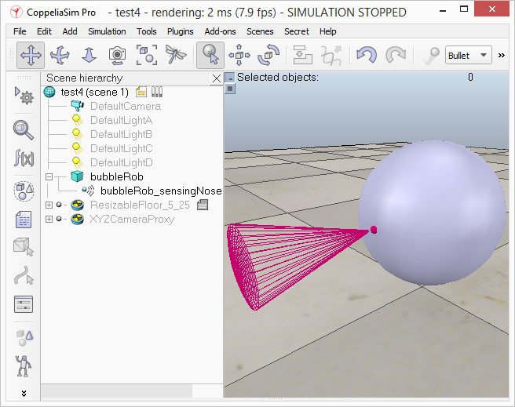
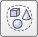
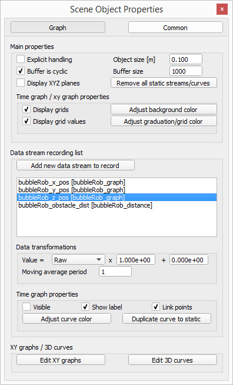
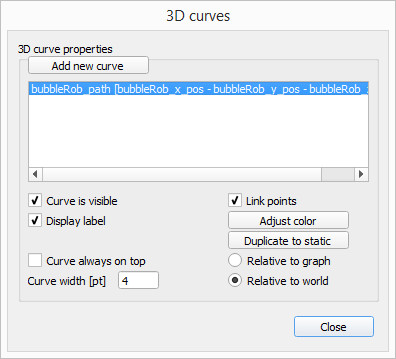
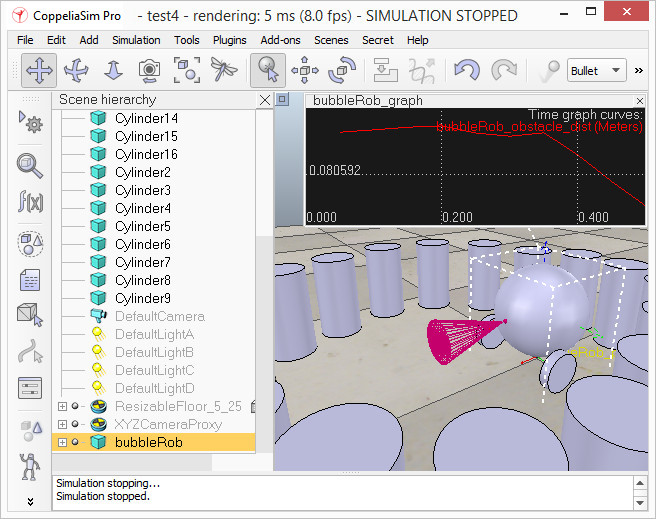

# BubbleRob Tutorial
[Source](https://www.coppeliarobotics.com/helpFiles/en/bubbleRobTutorial.htm)

This tutorial will try to introduce quite many CoppeliaSim functionalities while designing the simple mobile robot BubbleRob. The CoppeliaSim scene file related to this tutorial is located in CoppeliaSim's installation folder's tutorials/BubbleRob folder. Following figure illustrates the simulation scene that we will design:

We add a primitive sphere of diameter 0.2 to the scene with [Menu bar --> Add --> Primitive shape --> Sphere]. We adjust the X-size item to 0.2, then click OK. The created sphere will appear in the visibility layer 1 by default, and be dynamic and respondable (since we kept the item Create dynamic and respondable shape enabled). This means that BubbleRob's body will be falling and able to react to collisions with other respondable shapes (i.e. simulated by the physics engine). We can see this is the shape dynamics properties: items Body is respondable and Body is dynamic are enabled. We start the simulation (via the toolbar button, or by pressing `control-space` in the scene window), and copy-and-paste the created sphere (with [Menu bar --> Edit --> Copy selected objects] then [Menu bar --> Edit -> Paste buffer], or with `control-c` then `control-v`): the two spheres will react to collision and roll away. We stop the simulation: the duplicated sphere will automatically be removed. This default behaviour can be modified in the simulation dialog.

We also want the BubbleRob's body to by usable by the other calculation modules (e.g. the minimum distance calculation module). For that reason, we enable Collidable, Measurable, Renderable and Detectable in the object common properties for that shape, if not already enabled. If we wanted, we could now also change the visual appearance of our sphere in the shape properties.

Now we open the position dialog on the translation tab, select the sphere representing BubbleRob's body, and enter 0.02 for Along Z. We make sure that the Relative to-item is set to World. Then we click Translate selection. This translates all selected objects by 2 cm along the absolute Z-axis, and effectively lifted our sphere a little bit. In the scene hierarchy, we double-click the sphere's name, so that we can edit its name. We enter bubbleRob and press enter.

Next we will add a proximity sensor so that BubbleRob knows when it is approaching obstacles: we select [Menu bar --> Add --> Proximity sensor --> Cone type]. In the orientation dialog on the orientation tab, we enter 90 for Around Y and for Around Z, then click Rotate selection. In the position dialog, on the position tab, we enter 0.1 for X-coord. and 0.12 for Z-coord. The proximity sensor is now correctly positioned relative to BubbleRob's body. We double-click the proximity sensor's icon in the scene hierarchy to open its properties dialog. We click Show volume parameter to open the proximity sensor volume dialog. We adjust items Offset to 0.005, Angle to 30 and Range to 0.15. Then, in the proximity sensor properties, we click Show detection parameters. This opens the proximity sensor detection parameter dialog. We uncheck item Don't allow detections if distance smaller than then close that dialog again. In the scene hierarchy, we double-click the proximity sensor's name, so that we can edit its name. We enter bubbleRob_sensingNose and press enter.
We select bubbleRob_sensingNose, then control-select bubbleRob, then click [Menu bar --> Edit --> Make last selected object parent]. This attaches the sensor to the body of the robot. We could also have dragged bubbleRob_sensingNose onto bubbleRob in the scene hierarchy. This is what we now have:

Next we will take care of BubbleRob's wheels. We create a new scene with [Menu bar --> File --> New scene]. It is often very convenient to work across several scenes, in order to visualize and work only on specific elements. We add a pure primitive cylinder with dimensions (0.08,0.08,0.02). As for the body of BubbleRob, we enable Collidable, Measurable, Renderable and Detectable in the object common properties for that cylinder, if not already enabled. Then we set the cylinder's absolute position to (0.05,0.1,0.04) and its absolute orientation to (-90,0,0). We change the name to bubbleRob_leftWheel. We copy and paste the wheel, and set the absolute Y coordinate of the copy to -0.1. We rename the copy to bubbleRob_rightWheel. We select the two wheels, copy them, then switch back to scene 1, then paste the wheels.

We now need to add joints (or motors) for the wheels. We click [Menu bar --> Add --> Joint --> Revolute] to add a revolute joint to the scene. Most of the time, when adding a new object to the scene, the object will appear at the origin of the world. We Keep the joint selected, then control-select bubbleRob_leftWheel. In the position dialog, on the position tab, we click the Apply to selection button: this positioned the joint at the center of the left wheel. Then, in the orientation dialog, on the orientation tab, we do the same: this oriented the joint in the same way as the left wheel. We rename the joint to bubbleRob_leftMotor. We now double-click the joint's icon in the scene hierarchy to open the joint properties dialog. Then we click Show dynamic parameters to open the joint dynamics properties dialog. We enable the motor, and check item Lock motor when target velocity is zero. We now repeat the same procedure for the right motor and rename it to bubbleRob_rightMotor. Now we attach the left wheel to the left motor, the right wheel to the right motor, then attach the two motors to bubbleRob. This is what we have:

We run the simulation and notice that the robot is falling backwards. We are still missing a third contact point to the floor. We now add a small slider (or caster). In a new scene we and add a pure primitive sphere with diameter 0.05 and make the sphere Collidable, Measurable, Renderable and Detectable (if not already enabled), then rename it to bubbleRob_slider. We set the Material to noFrictionMaterial in the shape dynamics properties. To rigidly link the slider with the rest of the robot, we add a force sensor object with [Menu bar --> Add --> Force sensor]. We rename it to bubbleRob_connection and shift it up by 0.05. We attach the slider to the force sensor, then copy both objects, switch back to scene 1 and paste them. We then shift the force sensor by -0.07 along the absolute X-axis, then attach it to the robot body. If we run the simulation now, we can notice that the slider is slightly moving in relation to the robot body: this is because both objects (i.e. bubbleRob_slider and bubbleRob) are colliding with each other. To avoid strange effects during dynamics simulation, we have to inform CoppeliaSim that both objects do not mutually collide, and we do this in following way: in the shape dynamics properties, for bubbleRob_slider we set the local respondable mask to 00001111, and for bubbleRob, we set the local respondable mask to 11110000. If we run the simulation again, we can notice that both objects do not interfere anymore. This is what we now have:

We run the simulation again and notice that BubbleRob slightly moves, even with locked motor. We also try to run the simulation with different physics engines: the result will be different. Stability of dynamic simulations is tightly linked to masses and inertias of the involved non-static shapes. For an explanation of this effect, make sure to carefully read this and that sections. We now try to correct for that undesired effect. We select the two wheels and the slider, and in the shape dynamics dialog we click three times M=M*2 (for selection). The effect is that all selected shapes will have their masses multiplied by 8. We do the same with the inertias of the 3 selected shapes, then run the simulation again: stability has improved. In the joint dynamics dialog, we set the Target velocity to 50 for both motors. We run the simulation: BubbleRob now moves forward and eventually falls off the floor. We reset the Target velocity item to zero for both motors.
The object bubbleRob is at the base of all objects that will later form the BubbleRob model. We will define the model a little bit later. In the mean time, we want to define a collection of objects that represent BubbleRob. For that we define a collection object. We click [Menu bar --> Tools --> Collections] to open the collection dialog. Alternatively we can also open the dialog by clicking the appropriate toolbar button:

In the collection dialog, we click Add new collection. A new collection object appears in the list just below. For now the newly added collection is still empty (not defined). While the new collection item is selected in the list, select bubbleRob in the scene hierarchy, and then click Add in the collection dialog. Our collection is now defined as containing all objects of the hierarchy tree starting at the bubbleRob object (the collection's composition is displayed in the Composing elements and attributes section). To edit the collection name, we double-click it, and rename it to bubbleRob_collection. We close the collection dialog.
At this stage we want to be able to track the minimum distance between BubbleRob and any other object. For that, we open the distance dialog with [Menu bar --> Tools --> Calculation module properties]. Alternatively we can also open the calculation module properties dialog with the appropriate toolbar button:

In the distance dialog, we click Add new distance object and select a distance pair: [collection] bubbleRob_collection - all other measurable objects in the scene. This just added a distance object that will measure the smallest distance between collection bubbleRob_collection (i.e. any measurable object in that collection) and any other measurable object in the scene. We rename the distance object to bubbleRob_distance with a double-click in its name. We close the distance dialog. When we now run the simulation, we won't see any difference, since the distance object will try to measure (and display) the smallest distance segment between BubbleRob and any other measurable object in the scene. The problem is that at this stage there is no other measurable object in the scene (the shape defining the floor has its measurable property turned off by default). At a later stage in this tutorial, we will add obstacles to our scene.
Next we are going to add a graph object to BubbleRob in order to display above smallest distance, but also BubbleRob's trajectory over time. We click [Menu bar --> Add --> Graph] and rename it to bubbleRob_graph. We attach the graph to bubbleRob, and set the graph's absolute coordinates to (0,0,0.005). Now we open the graph properties dialog by double-clicking its icon in the scene hierarchy. We uncheck Display XYZ-planes, then click Add new data stream to record and select Object: absolute x-position for the Data stream type, and bubbleRob_graph for the Object / item to record. An item has appeared in the Data stream recording list. That item is a data stream of bubbleRob_graph's absolute x-coordinate (i.e. the bubbleRobGraph's object absolute x position will be recorded). Now we also want to record the y and z positions: we add those data streams in a similar way as above. We now have 3 data streams that represent BubbleRob's x-, y- and z-trajectories. We are going to add one more data stream so that we are able to track the minimum distance between our robot and its environment: we click Add new data stream to record and select Distance: segment length for the Data stream type, and bubbleRob_distance for the Object / item to record. In the Data stream recording list, we now rename Data to bubbleRob_x_pos, Data0 to bubbleRob_y_pos, Data1 to bubbleRob_z_pos, and Data2 to bubbleRob_obstacle_dist.

We select bubbleRob_x_pos in the Data Stream recording list and in the Time graph properties section, uncheck Visible. We do the same for bubbleRob_y_pos and bubbleRob_z_pos. By doing so, only the bubbleRob_obstacle_dist data stream will be visible in a time graph. Following is what we should have:

Next we will set-up a 3D curve that displays BubbleRob's trajectory: we click Edit 3D curves to open the XY graph and 3D curve dialog, then click Add new curve. In the dialog that pops open, we select bubbleRob_x_pos for the X-value item, bubbleRob_y_pos for the Y-value item and bubbleRob_z_pos for the Z-value item. We rename the newly added curve from Curve to bubbleRob_path. Finally, we check the Relative to world item and set Curve width to 4:

We close all dialogs related to graphs. Now we set one motor target velocity to 50, run the simulation, and will see BubbleRob's trajectory displayed in the scene. We then stop the simulation and reset the motor target velocity to zero.
We add a pure primitive cylinder with following dimensions: (0.1, 0.1, 0.2). We want this cylinder to be static (i.e. not influenced by gravity or collisions) but still exerting some collision responses on non-static respondable shapes. For this, we disable Body is dynamic in the shape dynamics properties. We also want our cylinder to be Collidable, Measurable, Renderable and Detectable. We do this in the object common properties. Now, while the cylinder is still selected, we click the object translation toolbar button:

Now we can drag any point in the scene: the cylinder will follow the movement while always being constrained to keep the same Z-coordinate. We copy and paste the cylinder a few times, and move them to positions around BubbleRob (it is most convenient to perform that while looking at the scene from the top). During object shifting, holding down the shift key allows to perform smaller shift steps. Holding down the ctrl key allows to move in an orthogonal direction to the regular direction(s). When done, select the camera pan toolbar button again:

We set a target velocity of 50 for the left motor and run the simulation: the graph view now displays the distance to the closest obstacle and the distance segment is visible in the scene too. We stop the simulation and reset the target velocity to zero.
We now need to finish BubbleRob as a model definition. We select the model base (i.e. object bubbleRob) then check items Object is model base and Object/model can transfer or accept DNA in the object common properties: there is now a stippled bounding box that encompasses all objects in the model hierarchy. We select the two joints, the proximity sensor and the graph, then enable item Ignored by model bounding box and click Apply to selection, in the same dialog: the model bounding box now ignores the two joints and the proximity sensor. Still in the same dialog, we disable camera visibility layer 2, and enable camera visibility layer 10 for the two joints and the force sensor: this effectively hides the two joints and the force sensor, since layers 9-16 are disabled by default. At any time we can modify the visibility layers for the whole scene. To finish the model definition, we select the vision sensor, the two wheels, the slider, and the graph, then enable item Select base of model instead: if we now try to select an object in our model in the scene, the whole model will be selected instead, which is a convenient way to handle and manipulate the whole model as a single object. Additionally, this protects the model against inadvertant modification. Individual objects in the model can still be selected in the scene by click-selecting them with control-shift, or normally selecting them in the scene hierarchy. We finally collapse the model tree in the scene hierarchy. This is what we have:

Next we will add a vision sensor, at the same position and orientation as BubbleRob's proximity sensor. We open the model hierarchy again, then click [Menu bar --> Add --> Vision sensor --> Perspective type], then attach the vision sensor to the proximity sensor, and set the local position and orientation of the vision sensor to (0,0,0). We also make sure the vision sensor is not not visible, not part of the model bounding box, and that if clicked, the model will be selected instead. In order to customize the vision sensor, we open its properties dialog. We set the Far clipping plane item to 1, and the Resolution x and Resolution y items to 256 and 256. We add a floating view to the scene, and over the newly added floating view, right-click [Popup menu --> View --> Associate view with selected vision sensor] (we make sure the vision sensor is selected during that process).

We attach a non-threaded child script to the vision sensor by clicking [Menu bar --> Add --> Associated child script --> Non threaded]. We double-click the little icon that appeared next to the vision sensor in the scene hierarchy: this opens the child script that we just added. We copy and paste following code into the script editor, then close it:

`function sysCall_vision(inData)
    simVision.sensorImgToWorkImg(inData.handle) -- copy the vision sensor image to the work image
    simVision.edgeDetectionOnWorkImg(inData.handle,0.2) -- perform edge detection on the work image
    simVision.workImgToSensorImg(inData.handle) -- copy the work image to the vision sensor image buffer
end`

`function sysCall_init()`
`end`

To be able to see the vision sensor's image, we start the simulation, then stop it again.
The last thing that we need for our scene is a small child script that will control BubbleRob's behavior. We select bubbleRob and click [Menu bar --> Add --> Associated child script --> Non threaded]. We double-click the script icon that appeared next to bubbleRob's name in the scene hierarchy and copy and paste following code into the script editor, then close it:

`function speedChange_callback(ui,id,newVal)`
`    speed=minMaxSpeed[1]+(minMaxSpeed[2]-minMaxSpeed[1])*newVal/100`
`end`

`function sysCall_init()`
`    -- This is executed exactly once, the first time this script is executed`
`    bubbleRobBase=sim.getObjectAssociatedWithScript(sim.handle_self) -- this is bubbleRob's handle`
`    leftMotor=sim.getObjectHandle("bubbleRob_leftMotor") -- Handle of the left motor`
`    rightMotor=sim.getObjectHandle("bubbleRob_rightMotor") -- Handle of the right motor`
`    noseSensor=sim.getObjectHandle("bubbleRob_sensingNose") -- Handle of the proximity sensor`
`    minMaxSpeed={50*math.pi/180,300*math.pi/180} -- Min and max speeds for each motor`
`    backUntilTime=-1 -- Tells whether bubbleRob is in forward or backward mode`
`    -- Create the custom UI:`
`        xml = '<ui title="'..sim.getObjectName(bubbleRobBase)..' speed" closeable="false" resizeable="false" activate="false">'..[[`
`        <hslider minimum="0" maximum="100" onchange="speedChange_callback" id="1"/>`
`        <label text="" style="* {margin-left: 300px;}"/>`
`        </ui>`
`        ]]`
`    ui=simUI.create(xml)`
`    speed=(minMaxSpeed[1]+minMaxSpeed[2])*0.5`
`    simUI.setSliderValue(ui,1,100*(speed-minMaxSpeed[1])/(minMaxSpeed[2]-minMaxSpeed[1]))`
`end`

`function sysCall_actuation()`
`    result=sim.readProximitySensor(noseSensor) -- Read the proximity sensor`
`    -- If we detected something, we set the backward mode:`
`    if (result>0) then backUntilTime=sim.getSimulationTime()+4 end `

`    if (backUntilTime<sim.getSimulationTime()) then`
`        -- When in forward mode, we simply move forward at the desired speed`
`        sim.setJointTargetVelocity(leftMotor,speed)`
`        sim.setJointTargetVelocity(rightMotor,speed)`
`    else`
`        -- When in backward mode, we simply backup in a curve at reduced speed`
`        sim.setJointTargetVelocity(leftMotor,-speed/2)`
`        sim.setJointTargetVelocity(rightMotor,-speed/8)`
`    end`
`end`

`function sysCall_cleanup()`
`	simUI.destroy(ui)`
`end`

We run the simulation. BubbleRob now moves forward while trying to avoid obstacles (in a very basic fashion). While the simulation is still running, change BubbleRob's velocity, and copy/paste it a few times. Also try to scale a few of them while the simulation is still running. Be aware that the minimum distance calculation functionality might be heavily slowing down the simulation, depending on the environment. You can turn that functionality on and off in the distance dialog, by checking / unchecking the Enable all distance calculations item.

Using a script to control a robot or model is only one way of doing. CoppeliaSim offers many different ways (also combined), have a look at the external controller tutorial.