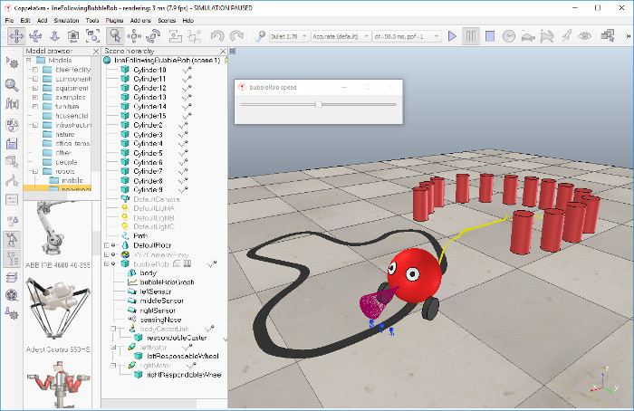

# Line following BubbleRob tutorial
In this tutorial we aim at extending the functionality of BubbleRob to let him/her follow a line on the ground. Make sure you have fully read and understood the first BubbleRob tutorial. This tutorial is courtesy of Eric Rohmer.

Load the scene of the first BubbleRob tutorial located in CoppeliaSim's installation folder, in tutorials/BubbleRob. The scene file related to this tutorial is located in tutorials/LineFollowingBubbleRob. Following figure illustrates the simulation scene that we will design:



We first create the first of 3 vision sensors that we will attach to the bubbleRob object. Select [Menu bar --> Add --> Vision sensor --> Orthographic type]. Edit its properties, by double-clicking on the newly created vision sensor icon in the scene hierarchy, and change the parameters to reflect following dialog:


The vision sensor has to be facing the ground, so select it, and in the orientation dialog, on the orientation tab, set [180;0;0] for the Alpha-Beta-Gamma items.

We have several possibilities to read a vision sensor. Since our vision sensor has just one pixel and operates in an easy way, we will simply query the average intensity value of the image read by our vision sensor. For more complex cases, we could have set-up a vision callback function. Now copy and paste the vision sensor twice, and adjust its names to bubbleRob_leftSensor, bubbleRob_middleSensor and bubbleRob_rightSensor. Make bubbleRob their parent (i.e. attach them to the bubbleRob object). Your sensors should now look like this in the scene hierarchy:


Let's position the sensors correctly. For that use the position dialog, on the position tab, and set following absolute coordinates:

left sensor: [0.2;0.042;0.018]
middle sensor: [0.2;0;0.018]
right sensor: [0.2;-0.042;0.018]
Now let's modify the environment. We can remove a few cylinders in front of BubbleRob. Next, we will build the path that the robot will try to follow. It is probaby better to switch to a top view from now on: select page 4 via the page selector toolbar button. Then click [Menu bar --> Add --> Path --> Circle type]. Enable the object movement with the mouse. You have two possibilities to adjust the shape of the path:

With the path (and only the path) selected, ctrl-click one of its control points. You can then drag them to the right position.
With the path selected, enter the path edit mode. In there, you have much more flexibility to adjust the individual path control points.
Once you are satisfied with the geometry of the path (you can always modify it at a later stage), select it, and uncheck Show orientation of points, Show path line and Show current position on path in the path properties. Then click Show path shaping dialog. This opens the path shaping dialog. Click Path shaping enabled, set the type to horizontal segment, and Scaling factor to 4.0. Finally adjust the color to black. There is a last important adjustment we have to make to the path: currently, the z-position of the path coincides with the z-position of the floor. The consequence is that sometimes we see the path, sometimes the floor (this effect is known as z-fighting in the openGl jargon). This not only affects what we see, but also what the vision sensors see. In order to avoid problems linked to z-fighting, just move the position of the path object up by 0.5 mm.
The last step is to adjust the controller of BubbleRob, so that it will also follow the black path. Open the child script attached to bubbleRob, and replace it with following code:

```function speedChange_callback(ui,id,newVal)
    speed=minMaxSpeed[1]+(minMaxSpeed[2]-minMaxSpeed[1])*newVal/100
end

function sysCall_init()
    -- This is executed exactly once, the first time this script is executed
    bubbleRobBase=sim.getObjectAssociatedWithScript(sim.handle_self)
    leftMotor=sim.getObjectHandle("bubbleRob_leftMotor")
    rightMotor=sim.getObjectHandle("bubbleRob_rightMotor")
    noseSensor=sim.getObjectHandle("bubbleRob_sensingNose")
    minMaxSpeed={50*math.pi/180,300*math.pi/180}
    backUntilTime=-1 -- Tells whether bubbleRob is in forward or backward mode
    floorSensorHandles={-1,-1,-1}
    floorSensorHandles[1]=sim.getObjectHandle("bubbleRob_leftSensor")
    floorSensorHandles[2]=sim.getObjectHandle("bubbleRob_middleSensor")
    floorSensorHandles[3]=sim.getObjectHandle("bubbleRob_rightSensor")
    -- Create the custom UI:
        xml = '<ui title="'..sim.getObjectName(bubbleRobBase)..' speed" closeable="false" resizeable="false" activate="false">'..[[
        <hslider minimum="0" maximum="100" onchange="speedChange_callback" id="1"/>
        <label text="" style="* {margin-left: 300px;}"/>
        </ui>
        ]]
    ui=simUI.create(xml)
    speed=(minMaxSpeed[1]+minMaxSpeed[2])*0.5
    simUI.setSliderValue(ui,1,100*(speed-minMaxSpeed[1])/(minMaxSpeed[2]-minMaxSpeed[1]))
end

function sysCall_actuation()
    result=sim.readProximitySensor(noseSensor)
    if (result>0) then backUntilTime=sim.getSimulationTime()+4 end

    -- read the line detection sensors:
    sensorReading={false,false,false}
    for i=1,3,1 do
        result,data=sim.readVisionSensor(floorSensorHandles[i])
        if (result>=0) then
            sensorReading[i]=(data[11]<0.3) -- data[11] is the average of intensity of the image
        end
        print(sensorReading[i])
    end

    -- compute left and right velocities to follow the detected line:
    rightV=speed
    leftV=speed
    if sensorReading[1] then
        leftV=0.03*speed
    end
    if sensorReading[3] then
        rightV=0.03*speed
    end
    if sensorReading[1] and sensorReading[3] then
        backUntilTime=sim.getSimulationTime()+2
    end

    if (backUntilTime<sim.getSimulationTime()) then
        -- When in forward mode, we simply move forward at the desired speed
        sim.setJointTargetVelocity(leftMotor,leftV)
        sim.setJointTargetVelocity(rightMotor,rightV)
    else
        -- When in backward mode, we simply backup in a curve at reduced speed
        sim.setJointTargetVelocity(leftMotor,-speed/2)
        sim.setJointTargetVelocity(rightMotor,-speed/8)
    end
end

function sysCall_cleanup()
	simUI.destroy(ui)
end```
You can easily debug your line following vision sensors: select one, then in the scene view select [Right-click --> Add --> Floating view], then in the newly added floating view select [Right click --> View --> Associate view with selected vision sensor].

Finally, remove the auxiliary items that were added in the first BubbleRob tutorial: remove the image processing vision sensor, its associated floating view, the floating view representing the obstacle clearance. Remove also the distance calculation object via the distance dialog. That's it!

